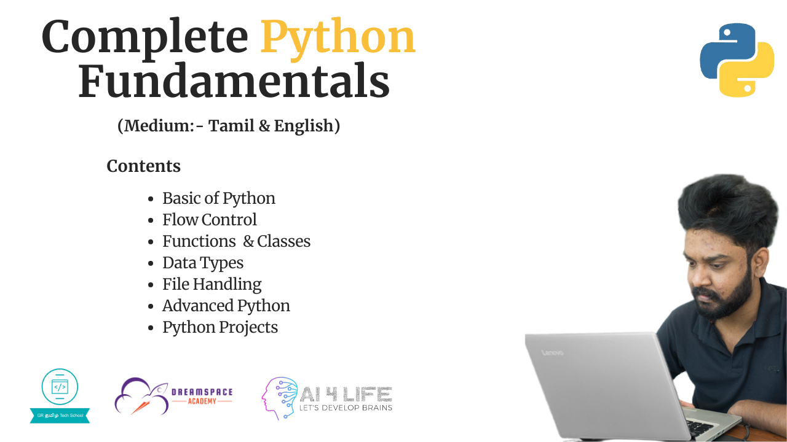

# Python Basic Fundamentals

## Introduction

This repository contains scripts that explains the basic fundamentals of Python programming. This is  very useful for beginner programmers to learn Python and use these scripts as references to code when they need helps.

This scripts are based on a YouTube tutorial that was posted as playlist at GR Tech School Channel.

* Python Playlist: [https://www.youtube.com/watch?v=rNIK271FiVI&list=PLk4mEzA6dvTLsrvIPbxLfEWX6f3CJlsiQ](https://www.youtube.com/watch?v=rNIK271FiVI&list=PLk4mEzA6dvTLsrvIPbxLfEWX6f3CJlsiQ)

Python is a popular programming language. It was created by Guido van Rossum, and released in 1991.

### What can Python do?
- Python can be used on a server to create web applications.
- Python can be used alongside software to create workflows.
- Python can connect to database systems. It can also read and modify files.
- Python can be used to handle big data and perform complex mathematics.
- Python can be used for rapid prototyping, or for production-ready software development.

## Social Links

* [Linkedin Profile](https://www.linkedin.com/in/gunarakulangunaretnam)
* [Facebook Profile](https://www.facebook.com/gunarakulangunaratnam)
* [Instagram Profile](https://www.instagram.com/gunarakulangunaretnam)
* [Twitter Profile ](https://twitter.com/gunarakulangr)
* [Kaggle Profile](https://www.kaggle.com/gunarakulangr)
* [TikTok Profile](https://www.tiktok.com/@gunarakulangunaretnam)
* [Youtube Profile](https://www.youtube.com/channel/UCMWkED5sabgVZSCKjZuRJXA)
